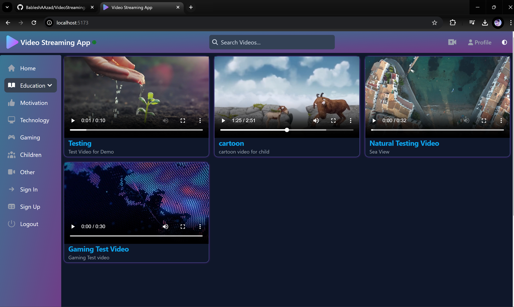
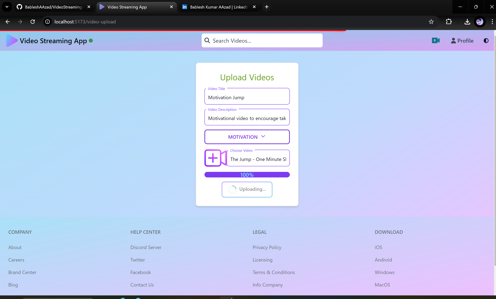

## 💻📽️ Video Streaming Web Application - API 📺📸

This project is a video streaming application, similar to YouTube or an e-learning platform. It implements the basic principles of video streaming, such as delivering data in chunks based on internet quality.
for frontend documentation : [Video Streaming Web App - UI](https://github.com/BableshAAzad/Video_Streaming_App-UI)
---

**🏠 Features:**
- Upload videos.
- Watch videos streamed in `.m3u8` format, which automatically adjusts video quality based on connection speed.
- Use of `.m3u8` files helps prevent data theft by avoiding video downloads.
- Search and sort videos based on your interests.

---

**🧑‍💻 Technologies Used:**

`Java` `Spring Boot` `Spring Data JPA` `Validation` `HATEOAS` `MySQL` `Lombok` `Advanced Java`

---

**💻 How to Use the Source Code:**

1. Download the `master` branch as a zip file.
2. Import the project into your IDE and ensure JDK 21 and MySQL database are installed.
3. Set up the environment variables as described below.

#### 🔐 Environment Variables:
<u>For Database:</u>
>1. `DB_HOST_NAME` = localhost
>2. `DB_NAME` = your_db_name
>3. `DB_PASSWORD` = root
>4. `DB_PORT` = 3306
>5. `DB_USERNAME` = root

---

#### 📝 Project UI Examples 🔍

>- 🔍📺📽️ Home Page
<p align="center">
  
</p>

>- 📸📹 Video upload Page
<p align="center">
  
</p>

**Response:**
  ```json
  {
  "status": 200,
  "message": "Videos are founded",
  "data": {
    "links": [],
    "content": [
      {
        "videoId": "06c6dc6b-d63e-40f5-95dc-310b8ba0f3cb",
        "title": "Nature",
        "description": "Nature demo video",
        "contentType": "video/mp4",
        "filePath": "videos\\video-1.mp4"
      },
      {
        "videoId": "078705d4-fdea-42f1-ac0f-6557037adf07",
        "title": "Cartoon Dyno",
        "description": "Cartoon demo video",
        "contentType": "video/mp4",
        "filePath": "videos\\video-2.mp4"
      },
      {
        "videoId": "0cbd6040-0e4e-47b6-9f66-86f8c9554835",
        "title": "Mountain Views",
        "description": "Test video here shown view of mountains",
        "contentType": "video/mp4",
        "filePath": "videos\\video-3.mp4"
      }
    ],
    "page": {
      "size": 5,
      "totalElements": 3,
      "totalPages": 1,
      "number": 0
    }
  }
}
  ```
---
